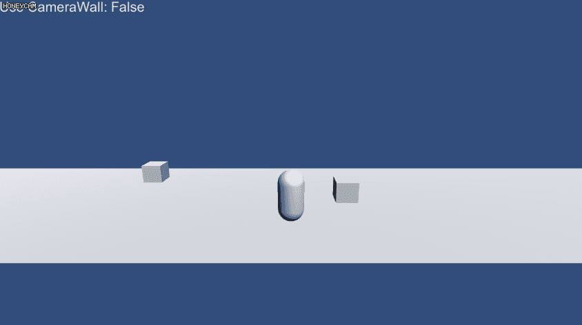
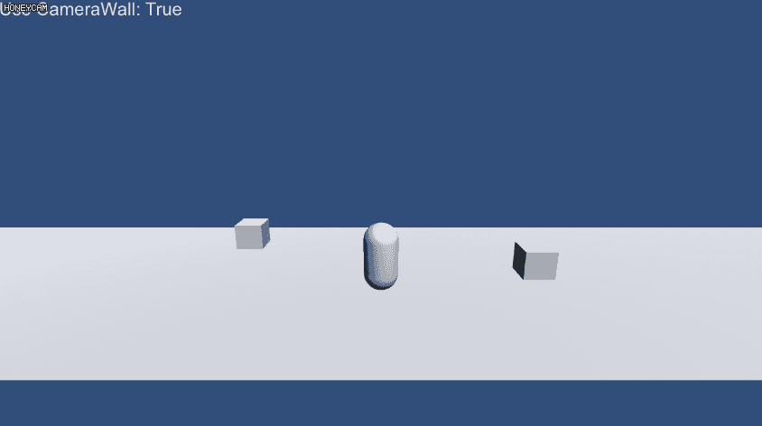

# Unity-PerspectiveCameraWall

## What is this?

Set invisivle walls what camera doesn't show.
You can use this at belt scroll action game using Perspective camera.

카메라가 넘어갈 수 없는 보이지 않는 벽을 설치합니다.
Perspective 카메라를 사용하는 횡스크롤 게임 등에 사용할 수 있습니다.

カメラに映らない見えない壁を設定します。
Perspective カメラを使う横スクロールアクションゲームなどでご利用できます。

## Before

## After

